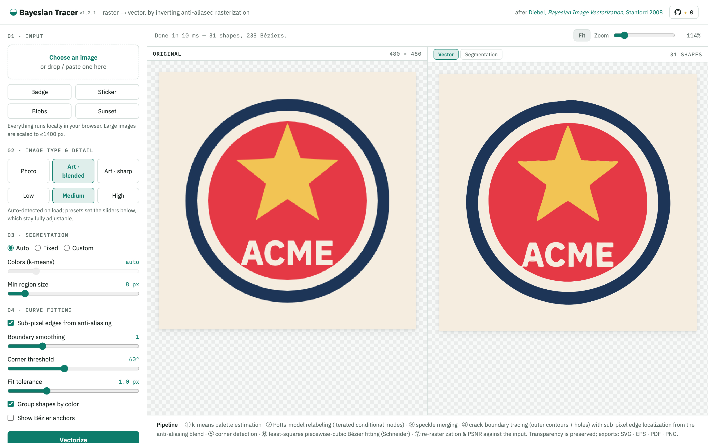

# Bayesian Tracer

Turn bitmap images into vector art, entirely in your browser. It's a single HTML file with no dependencies, and your images never leave your machine.

## ▶ [Open the live app](https://shihanqu.github.io/bayesian-tracer/)

<a href="https://shihanqu.github.io/bayesian-tracer/">
  <picture>
    <source media="(prefers-color-scheme: dark)" srcset="docs/screenshot-dark.png">
    
  </picture>
</a>

The tracer reimplements the vectorization pipeline from James Diebel's 2008 Stanford thesis, [*Bayesian Image Vectorization: The Probabilistic Inversion of Vector Image Rasterization*](https://www.semanticscholar.org/paper/a1336e0f16e8099ba687ff361b98c184aa160edd), the research that became Vector Magic. The core idea is that anti-aliasing is not noise. A blended edge pixel tells you where the true edge sits inside that pixel, so the tracer reads blend fractions to place boundaries at sub-pixel accuracy instead of snapping them to the pixel grid.

## What it does

Drop in a PNG, JPG, WebP, GIF, or BMP (anywhere on the page, or paste from the clipboard) and it produces layered vector shapes you can export as SVG, EPS, PDF, AI, or PNG. The pipeline:

1. k-means palette estimation (automatic, fixed count, or a custom palette you edit by hand)
2. Potts-model relabeling with iterated conditional modes, which absorbs anti-aliased edge pixels into their neighboring regions
3. speckle merging with a union-find pass
4. crack-boundary tracing of every region, including holes
5. sub-pixel edge placement from the anti-aliasing blend; at transparent edges the alpha channel is the blend
6. corner detection, then least-squares piecewise cubic Bézier fitting (Schneider's algorithm)
7. re-rasterization of the result and a PSNR score against the input

## Using it

The app classifies each image on load (photograph, artwork with blended edges, or artwork with sharp edges) and applies a matching preset. The sliders underneath stay live, so a preset is a starting point rather than a mode.

If the segmentation gets something wrong, switch to the Segmentation tab and fix the pixels directly: paint with any palette color, zap a stray segment into its largest neighbor, or paint with the transparent swatch to remove a background. Then hit Re-vectorize. Source transparency is kept through to the exports.

When zoomed in, the mouse wheel scrolls a pane and dragging with the middle mouse button pans it. The two panes stay in sync either way.

## Running locally

Open `index.html` in a browser. That's the whole install. If you'd rather serve it:

```bash
python3 -m http.server 8123
```

## Notes and limits

The output is flat-color regions, like Vector Magic's logo mode, so photographs come out posterized. Raising the color count gets you more bands. Images larger than 1400 px on a side are scaled down before tracing.

The AI export writes a PDF-compatible `.ai` file. Modern `.ai` is a PDF container, and Illustrator opens plain vector PDF with fully editable paths. The EPS and PDF exporters are minimal hand-written generators, good for flat vector shapes and nothing else.

Each region's boundary is fitted independently. Adjacent shapes get a thin same-color stroke to hide the sub-pixel mismatch along shared edges, which is a visual fix rather than the shared-boundary fitting the thesis describes.

Not affiliated with Vector Magic, Inc. The thesis is cited above; the code here is an independent reimplementation.
